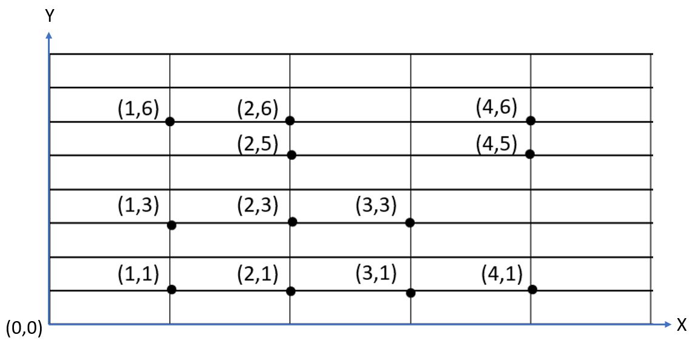

# Finding unique rectangles

In this question, a developer is presented with the problem of finding the total number of unique rectangles from a collection of points from a graph.

For example, the given graph consists of 12 points. How many unique rectangles exist? 



## Support Code (Python)
<sub>While the example code is in Python, question can be resolved in any language</sub>

### Point Class - Starter
```python
class Point:
    """
    An individual point on a graph with X/Y coordinates
    """
    def __init__(self, x:int, y:int):
        self.X = x
        self.Y = y
```

### Points to iterate on
```python
import typing

graph:typing.List[Point] = [
    Point(1,1), Point(2,1), Point(1,3), 
    Point(4,1), Point(4,5), Point(2,5), 
    Point(4,6), Point(1,6), Point(3,3),
    Point(2,3), Point(3,1), Point(2,6)
]
```
